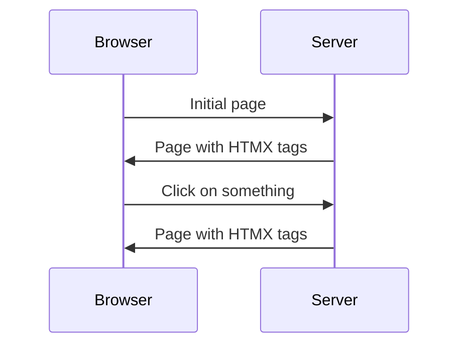
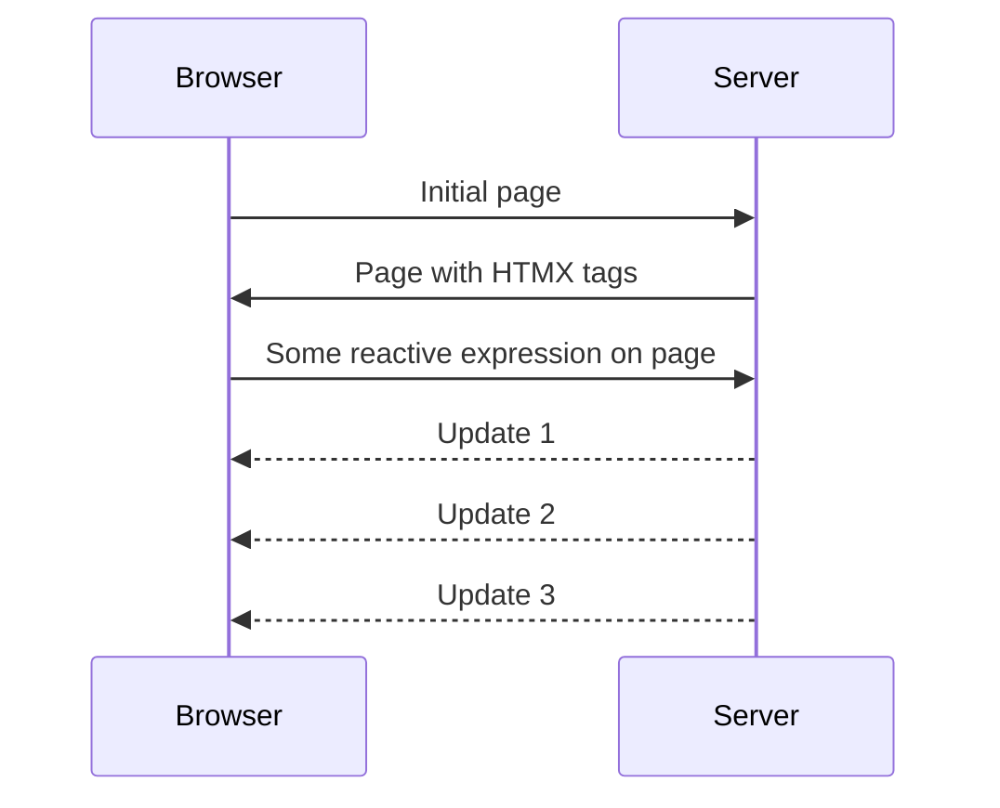

---
# You can also start simply with 'default'
theme: default
# random image from a curated Unsplash collection by Anthony
# like them? see https://unsplash.com/collections/94734566/slidev
background: https://images.unsplash.com/photo-1691331170260-39662795f1bc?q=80&w=2998&auto=format&fit=crop&ixlib=rb-4.0.3&ixid=M3wxMjA3fDB8MHxwaG90by1wYWdlfHx8fGVufDB8fHx8fA%3D%3D
# some information about your slides (markdown enabled)
title: Welcome to Slidev
info: |
  ## Slidev Starter Template
  Presentation slides for developers.

  Learn more at [Sli.dev](https://sli.dev)
# apply unocss classes to the current slide
class: text-center
# https://sli.dev/features/drawing
drawings:
  persist: false
# slide transition: https://sli.dev/guide/animations.html#slide-transitions
transition: slide-left
# enable MDC Syntax: https://sli.dev/features/mdc
mdc: true

---

# Datastar
Real-time hypermedia

Embrace the web, explore new frontiers

---
layout: intro
---
# Hi, I'm Delaney

<v-clicks depth="3">

- I 💗 reactive content
    - Game dev first
    - Applications vs static sites
    - Used most SPA frameworks at scale
        - Mootools / Jquery / Backbone
        - Angular / React/  Angular 2
        - Vue / Svelte / Solid

- I 💗 NATS
    - Now work at Synadia (company behind the project)
    - Spend quite a bit of time making POCs and demos for customers
    - Distributive apps are a challenge, change comes for any where

</v-clicks>

---

<v-clicks depth="3">

- Even with all the frameworks SPA available unhappy with client side
    - Million NPM Modules
    - Routing woes
    - Validation overlap
    - Security
        - CORS
        - JWT
        - Runtime content auth checks
    - Dynamic content
    - JSON + *"REST"* APIs

</v-clicks>

---
layout: image-right
image: /pages/images/better_way.gif
backgroundSize: contain
---

# Got to be a better way

<v-clicks depth="2">

- Server side first approach
    - Latency?
    - Components
    - Boring old pages?
    - 2001 called, they want their web back

</v-clicks>

---
layout: image-right
image: /pages/images/hypermedia-systems.png
backgroundSize: contain
---
# HTMX to the rescue

<v-clicks depth="2">

- Simple `hx-` tags
- Indicators when loading
- Focus on ***real*** hypermedia
    - https://hypermedia.systems/ is a great resource
- But ...
</v-clicks>

---
layout: image-right
image: /pages/images/7b.png
backgroundSize: contain
---

# HTMX has rough edges


<v-clicks depth="3">

- https://htmx.org/essays/htmx-sucks/
- > Rule 7b: If you suggest a feature or change and someone calls 7b on you, you are asked to implement it (either entirely or as a proof of concept) or fix it
    - https://github.com/delaneyj/nothtmx2
        - Tried moving to Typescript + Vite
        - Hundreds of issues
        - Not pure JS, not seen as worth the change
            - 
    - Got the bug to ***really*** fix it
- Agree with the hypermedia first approach but not the implementation

</v-clicks>

---
layout: center
---
# What I want

<v-clicks depth="3">

- ***Everything*** is a plugin
- HTML Spec compliant
- Reactivity via signals
- No VDOM
- Server Sent Events first
- Two-way binding
- Scrolling
- Animation
- View transition API
- Able to fully replace a SPA
- Tree shaking and small
- Easy to add plugins

</v-clicks>


---

# Let's use data attributes

https://developer.mozilla.org/en-US/docs/Learn/HTML/Howto/Use_data_attributes

````md magic-move
```html
<div>
    <input type="text" placeholder="Type here!"/>
</div>
```

```html
<div data-store="{input:'hello'}>
    <input type="text" placeholder="Type here!"/>
</div>
```

```html
<div data-store="{input:'hello'}>
    <input type="text" placeholder="Type here!" data-model="input" />
</div>
```

```html
<div data-store="{input:'hello'}>
    <input type="text" placeholder="Type here!" data-model="input" />
    <div data-text="$input">
</div>
```

```html
<div data-store="{input:'hello'}>
    <input type="text" placeholder="Type here!" data-model="input" />
    <div data-text="$input.toUppercase()">
</div>
```

```html
<div data-store="{input:'hello', show:false}>
    <input type="text" placeholder="Type here!" data-model="input" />
    <div data-text="$input.toUppercase()">
</div>
```

```html
<div data-store="{input:'hello', show:false}>
    <input type="text" placeholder="Type here!" data-model="input" />
    <div data-text="$input.toUppercase()">
    <button data-on-click="$show=!$show">Toggle</button>
</div>
```

```html
<div data-store="{input:'hello', show:false}>
    <input type="text" placeholder="Type here!" data-model="input" />
    <div data-text="$input.toUppercase()">
    <button data-on-click="$show=!$show">Toggle</button>
    <div data-show="$show">
        <span>Hello From Datastar!</span>
    </div>
</div>
```

```html
<div>
    <button>Click me<button>
    <div id="output">I'm where server code will update</div>
</div>
```

```html
<div>
    <button data-on-click="$$put('/do_something')">Click me<button>
    <div id="output">I'm where server code will update</div>
</div>
```
````

---

# data-* attributes all the way down

<v-clicks depth="3">

1. Take the work you have to do anytime you use fine grain reactive signals
1. Put them in a declarative `data-*` attributes
1. Get back to application logic
1. ????
1. **PROFIT**

</v-clicks>


---
layout: center
---
# Welcome to Datastar


---
layout: two-cols
---
# Key Features

Push vs Pull

HTMX Flow

- Your render your `hx-` tags into the next render fragment
- If you want to update it's primarily polling

::right::



---
layout: two-cols
---

# Key Features

Push vs Pull

Datastar Flow

- Intial page
- Send *N* updates depending on state
- Same workflow for 1 or thousands of updates
- Works with any HTTP server with flushing support
- Works with all HTTP verbs with full error handling and chunking

::right::



---

# Plugins I need from Alpine + HTMX

<v-clicks depth="3">

- Bind to any attribute `data-bind-src`
- Two way binding of inputs `data-model`
- Text `data-text`
- Events `data-on-click` `data-online`
    - Custom events `data-on-load` `data-on-store-changed`
    - Throttling/Debounce `data-on-raf.debounce_250ms`
- Refs `data-ref`
- Reactive Stores `data-store`
- Visibility `data-show`
- Intersect `data-intersects`
- Scrolling `data-scroll-into-view`
- HTMX like support `$$get`
- Animation helpers `$$fit`

</v-clicks>

---
layout: center
---
# It's actually smaller


---

# It's easier than Alpine + HTMX

<v-clicks depth="3">

- You don't have competing event models
- Signals first reducing complexity for user
    - Harder for plugin developers
- Datastar plugins are aware of each other
- Less typing checking inside of plugins
- One way to do things, scales easier
</v-clicks>

---

# Let's make a real-time TODO MVC

