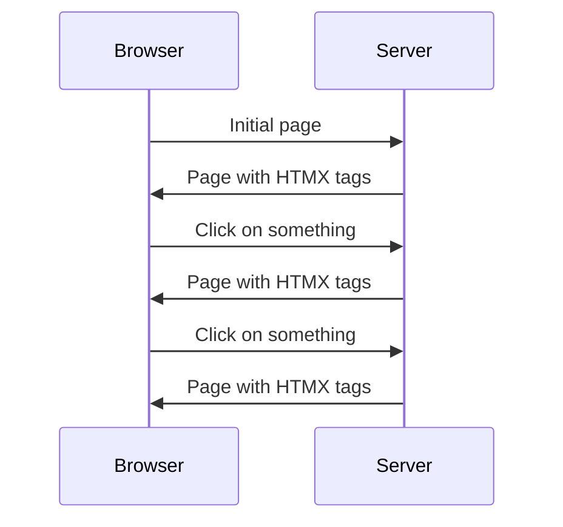
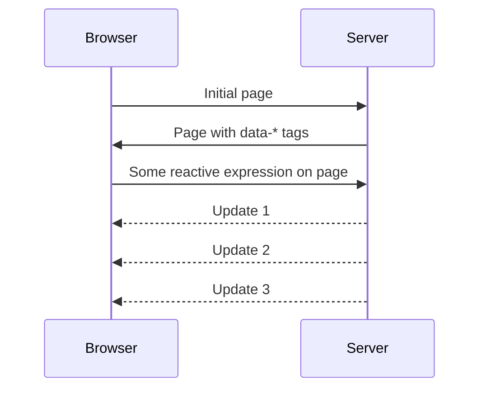
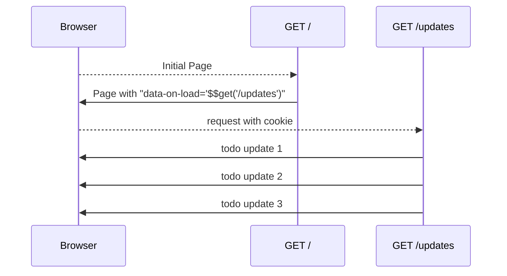
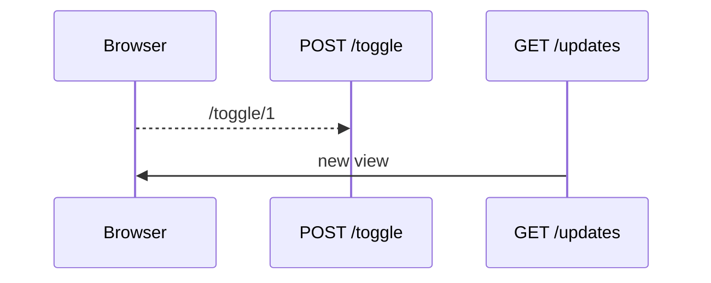
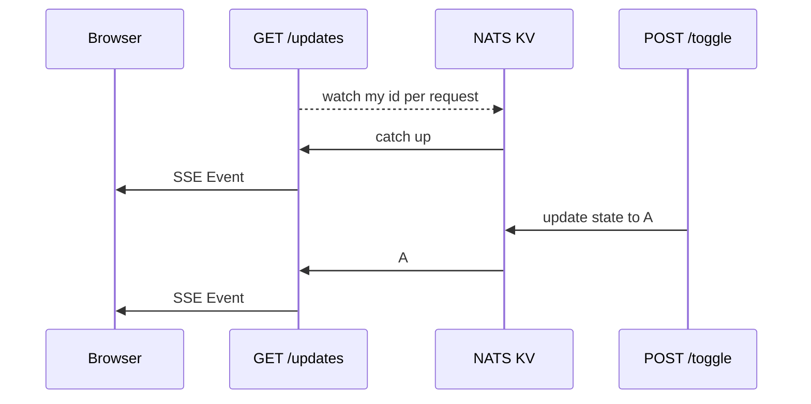

---
# You can also start simply with 'default'
theme: default
# random image from a curated Unsplash collection by Anthony
# like them? see https://unsplash.com/collections/94734566/slidev
background: /pages/images/bg_blur.png
# some information about your slides (markdown enabled)
title: Datastar
fonts:
    sans: Inter
    serif: Orbitron
    mono: Fira COde
    italic: true

info: |
  ## Slidev Starter Template
  Presentation slides for developers.

  Learn more at [Sli.dev](https://sli.dev)
# apply unocss classes to the current slide
class: text-center
# https://sli.dev/features/drawing
drawings:
  persist: false
# slide transition: https://sli.dev/guide/animations.html#slide-transitions
transition: slide-left
# enable MDC Syntax: https://sli.dev/features/mdc
mdc: true

---

# DATASTAR
Real-time hypermedia UI framework

Embrace the web, explore new frontiers

<!--
# X
This is a ***note***
-->

---
layout: intro
---
# Hi, I'm Delaney

<v-clicks depth="3">

- I 💗 reactive content
    - Game dev first
    - Applications vs static sites
    - Used most SPA frameworks at scale
        - Mootools / Jquery / Backbone
        - Angular / React/  Angular 2
        - Vue / Svelte / Solid

- I 💗 NATS
    - Now work at [Synadia](https://www.synadia.com/) (company behind the project)
    - Spend quite a bit of time making POCs and demos for customers
    - Distributive apps are a challenge, change comes for any where

</v-clicks>

---
layout: two-cols
---

# Single Page Applications are a pain
<v-clicks depth="3">

- Even with all the frameworks SPA available unhappy with client side
    - Million NPM Modules
    - Routing woes
    - Validation overlap
    - Security
        - CORS
        - JWT
        - Runtime content auth checks
    - Dynamic content
</v-clicks>


---
layout: two-cols
---

# Single Page Applications are a pain
- Even with all the frameworks SPA available unhappy with client side
    - Million NPM Modules
    - Routing woes
    - Validation overlap
    - Security
        - CORS
        - JWT
        - Runtime content auth checks
    - Dynamic content
    - JSON + *"REST"* APIs

::right::


---
layout: image-right
image: /pages/images/better_way.gif
backgroundSize: contain
---

# Got to be a better way

<v-clicks depth="2">

- Server side first approach
    - Latency?
    - Components
    - Boring old pages?
    - 2001 called, they want their web back

</v-clicks>

---
layout: image-right
image: /pages/images/hypermedia-systems.png
backgroundSize: contain
---
# HTMX to the rescue

<v-clicks depth="2">

- Simple `hx-` tags
- Indicators when loading
- Focus on ***real*** hypermedia
    - https://hypermedia.systems/ is a great resource
    - Especially Part 1 before it becomes a HTMX tutorial
- But ...
</v-clicks>

---
layout: image-right
image: /pages/images/7b.png
backgroundSize: contain
---

# HTMX has rough edges


<v-clicks depth="3">

- https://htmx.org/essays/htmx-sucks/
- > Rule 7b: If you suggest a feature or change and someone calls 7b on you, you are asked to implement it (either entirely or as a proof of concept) or fix it
    - https://github.com/delaneyj/nothtmx2
        - Tried moving to Typescript + Vite
        - Hundreds of issues
        - Not pure JS, not seen as worth the change 
    - Got the bug to ***really*** fix it
- Agree with the hypermedia first approach but not the implementation

</v-clicks>

---
layout: center
---
# What I want

<v-clicks depth="3">

- ***Everything*** is a plugin
- HTML Spec compliant
- Reactivity via signals
- No VDOM
- Server Sent Events first
- Two-way binding
- Scrolling
- Animation
- View transition API
- Able to fully replace a SPA
- Tree shaking and small
- Easy to add plugins
- Market place of ideas, à la carte

</v-clicks>


---

# Let's use data attributes

https://developer.mozilla.org/en-US/docs/Learn/HTML/Howto/Use_data_attributes

<Transform :scale="1.5">
````md magic-move
```html
<div>
    <input type="text" placeholder="Type here!"/>
</div>
```

```html
<div data-store="{input:'hello'}>
    <input type="text" placeholder="Type here!"/>
</div>
```

```html
<div data-store="{input:'hello'}>
    <input type="text" placeholder="Type here!" data-model="input" />
</div>
```

```html
<div data-store="{input:'hello'}>
    <input type="text" placeholder="Type here!" data-model="input" />
    <div data-text="$input">
</div>
```

```html
<div data-store="{input:'hello'}>
    <input type="text" placeholder="Type here!" data-model="input" />
    <div data-text="$input.toUppercase()">
</div>
```

```html
<div data-store="{input:'hello', show:false}>
    <input type="text" placeholder="Type here!" data-model="input" />
    <div data-text="$input.toUppercase()">
</div>
```

```html
<div data-store="{input:'hello', show:false}>
    <input type="text" placeholder="Type here!" data-model="input" />
    <div data-text="$input.toUppercase()">
    <button data-on-click="$show=!$show">Toggle</button>
</div>
```

```html
<div data-store="{input:'hello', show:false}>
    <input type="text" placeholder="Type here!" data-model="input" />
    <div data-text="$input.toUppercase()">
    <button data-on-click="$show=!$show">Toggle</button>
    <div data-show="$show">
        <span>Hello From Datastar!</span>
    </div>
</div>
```

```html
<script
    type="module" defer
    src="https://cdn.jsdelivr.net/npm/@sudodevnull/datastar">
</script>
<div data-store="{input:'hello', show:false}>
    <input type="text" placeholder="Type here!" data-model="input" />
    <div data-text="$input.toUppercase()">
    <button data-on-click="$show=!$show">Toggle</button>
    <div data-show="$show">
        <span>Hello From Datastar!</span>
    </div>
</div>
```
````
</Transform>

---


# Let's use interact with the backend

<Transform :scale="1.5">
````md magic-move
```html
<div>
    <button>Click me<button>
    <div>I'm where server code will update</div>
</div>
```

```html
<div>
    <button data-on-click="$$put('/do_something')">Click me<button>
    <div>I'm where server code will update</div>
</div>
```

```html
<div>
    <button data-on-click="$$put('/do_something')">Click me<button>
    <div id="output">I'm where server code will update</div>
</div>
```
````
</Transform>

---
layout: center
---
# data-* attributes all the way down

<v-clicks depth="3">

1. Take the work you have to do anytime you use fine grain reactive signals
1. Put them in a declarative `data-*` attributes
1. Get back to application logic
1. ????
1. **PROFIT**

</v-clicks>


---
layout: center
---
# Welcome to Datastar


---
layout: two-cols
---
# Key Features

Push vs Pull

HTMX Flow

- Your render your `hx-` tags into the next render fragment
- If you want to update it's primarily polling
- Normal HTTP verbs

::right::



---
layout: two-cols
---

# Key Features

Push vs Pull

Datastar Flow

- Initial page
- Send *N* updates depending on state
- Same workflow for 1 or thousands of updates
- Works with any HTTP server with flushing support
- Works with all HTTP verbs with full error handling and chunking
- Still normal HTTP verbs, no need for websockets

::right::



---
layout: center
---
# Plugins I need for a full framework

<v-clicks depth="3">

- Bind to any attribute `data-bind-src`
- Two way binding of inputs `data-model`
- Text `data-text`
- Events `data-on-click` `data-online`
    - Custom events `data-on-load` `data-on-store-changed`
    - Throttling/Debounce `data-on-raf.debounce_250ms`
    - Targeting window `data-on-offline.window`
- Refs `data-ref`
- Reactive Stores `data-store`
- Visibility `data-show`
- Intersect `data-intersects`
- Scrolling `data-scroll-into-view`
- HTMX like support `$$get` `$$put` `$$post` `$$delete` `$$patch`
- Animation helpers `$$fit` `$$toggle`

</v-clicks>

---
layout: center
---
# It's actually smaller


---
layout: center
---
# It's easier than multiple libraries


<v-clicks depth="3">

- You don't have competing event models
- Signals first reducing complexity for user
    - But it's pushing that on the plugin developers
- Datastar plugins are aware of each other
- Less typing checking inside of plugins
- One way to do things, scales easier
</v-clicks>

::right::


---
layout: image-right
image: /pages/images/todomvc.png
---


# Let's make a [TodoMVC](https://todomvc.com/)

<v-clicks depth="3">

- Used to compare SPA frameworks
- Minimal application
- More about the vibe

</v-clicks>


---
layout: two-cols
---
# Let's make a ***real-time*** TodoMVC

## Initialize

- Get the initial HTML
    - Hands back a cookie with an ID
- Hookup a single `GET` for `/updates`
    - Uses cookie to get personalize todo


::right::

<Transform :scale="1">

</Transform>

---
layout: two-cols
---
# Let's make a ***real-time*** TodoMVC

## Update

- Commands can come from anywhere
    - HTTP Request
    - Another service
    - Another user
    - Event bus
- Command Query Responsibility Segration (CQRS)
    - Decouple reads from writes
    - Commands succeed or fail but don't return state
    - Not needed for simple apps but scales well

::right::

<Transform :scale="1">

</Transform>

---
layout: two-cols
---
# Let's make a ***real-time*** TodoMVC

## NATS to the rescue

<v-clicks depth="3">

- Gradient of features
    - Scales from embedded to global superclusters
    - Any language
    - Any message format
    - Key Value + Object Store
    - High Availablity + Persistence
- Let's use the KV
    - Key = ID from cookie
    - Value = Todo State
    - Watch from updates
    - TTL of 15 minutes

</v-clicks>

---
layout: two-cols
---
# Let's make a ***real-time*** TodoMVC

## NATS to the rescue

- Gradient of features
    - Scales from embedded to global superclusters
    - Any language
    - Any message format
    - Key Value + Object Store
    - High Availablity + Persistence
- Let's use the KV
    - Key = ID from cookie
    - Value = Todo State
    - Watch from updates
    - TTL of 15 minutes

::right::

<Transform :scale="1.1">

</Transform>

---
layout: fact
---

### Let's play with the Datastar home page
## https://data-star.dev


---
layout: two-cols
background: /pages/images/bg_blur.png
---

# Questions?
* https://twitter.com/DelaneyGillilan
* https://data-star.dev
* https://github.com/delaneyj/datastar
::right::
<Transform :scale="0.625">
<Tweet id="1824478943610568900"/>
</Transform>