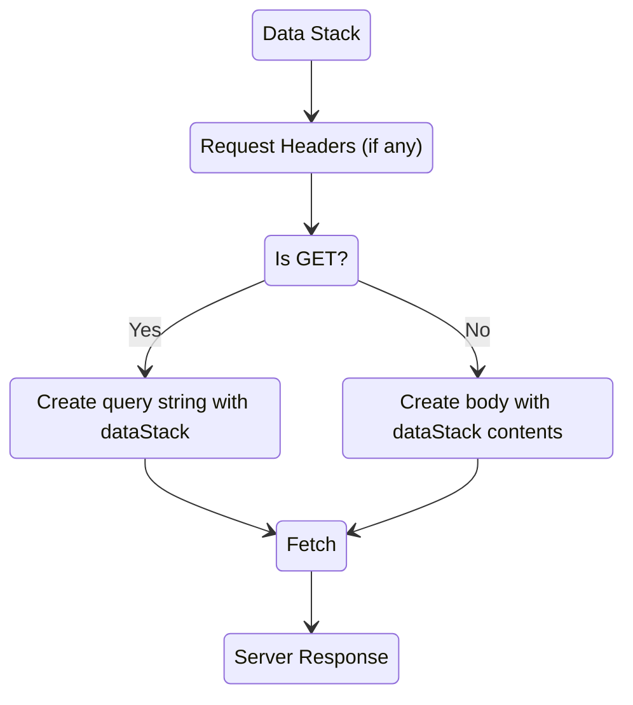
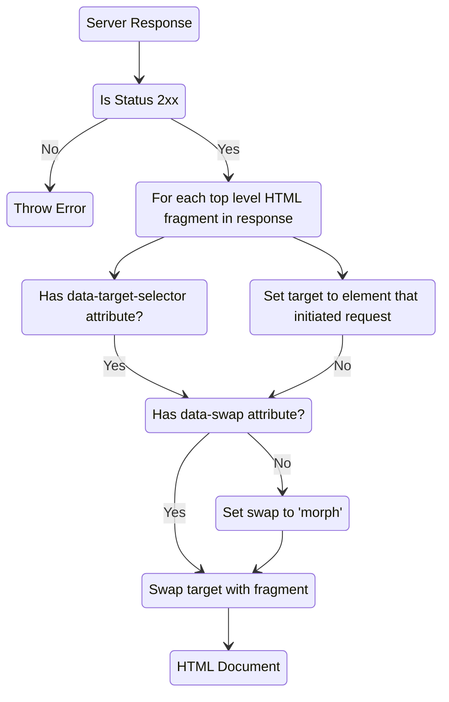

[Back to Intersects](/docs/included-plugins-ui-intersects)

# HTML Fragments

## Why

This is a more explicit take on the same kind of behavior that [HTMX](https://htmx.org/) provides.  It allows you to declaratively use [fetch](https://developer.mozilla.org/en-US/docs/Web/API/Fetch_API) to create and merge HTML snippets from the server of your choice.  It's not to be as generic as HTMX but feel the defaults put you in the [pit of success](https://blog.codinghorror.com/falling-into-the-pit-of-success/).


## Example

```html
<div data-get="/api/globalCount" data-on-click="@get"/>
```

## Data-* Attributes
All attributes are expressions that should resolve to a URL string.
* `data-get`
* `data-post`
* `data-put`
* `data-patch`
* `data-delete`

## Actions
All actions send off a request to the URL specified in the data-* attribute and merge the response into the element.  The default behavior is to replace the element with the response.  You can change this behavior by modulating your response.

* `@get`
* `@post`
* `@put`
* `@patch`
* `@delete`

## The Request


# The Response


| Attribute | Description |
| --- | --- |
| `data-target="selector"` | The element to replace with the response.  If not specified, the element that initiated the request will be used. |
| `data-swap="morph"` | Use [idiomorph](https://github.com/delaneyj/datastar/blob/main/library/src/lib/external/idiomorph.ts) base on [bigskysoftware/idiomorph](https://github.com/bigskysoftware/idiomorph)
| `data-swap="inner"` | Replace inner html of element |
| `data-swap="outer"` | Replace entire element |
| `data-swap="prepend"` | Insert as first child of element |
| `data-swap="append"` | Insert as last child of element |
| `data-swap="before"` | Insert before element |
| `data-swap="after"` | Insert after element |
| `data-swap="delete"` | Remove element |


[Next Headers](/docs/included-plugins-html-partials-headers)
